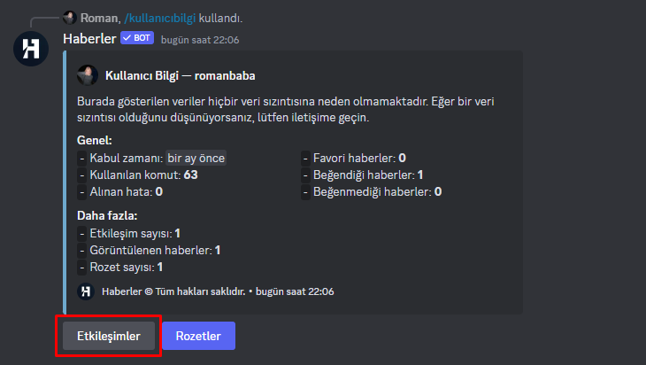
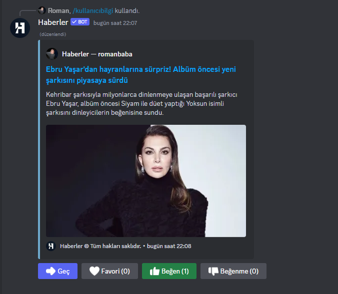

# Keşfet komutunda verdiğim etileşimleri nasıl görüntüleyebilirim?
`/keşfet` komutu Haberler için yaptığımız en iyi işlerden biri olsa gerek, istediğiniz haberi `beğenebilir`, `beğenmeyebilir` ve `favorileyebilirsiniz` yaptığınız bu etkileşimleri görüntülemek için aşağıdaki adımları inceleyin:

- `kullanıcıbilgi` komutunu kullanın
  - Aşağıda bir buton seçimi olacak siz ilk olan butona yani **Etkileşimler** butonuna tıklayacaksınız.
  
  - İşte bu kadar basit, burada yaptığınız etkileşimleri görüntüleyebilirsiniz. **Geç** tuşuna basarak bir sonraki etkileşiminizi görebilirsiniz.
  
  - Eğer mevcut etkileşiminizi geri almak istiyorsanız mevcut bastığınız etkileşime bir kez tıklayarak etkileşiminizi geri alabilirsiniz.

# Bağlantılar
[Topluluk sunucumuz](https://discord.gg/r3AdKRY9Ha) | [Oy ver](https://bit.ly/oyver) | [Github](https://github.com/haberlerbot)