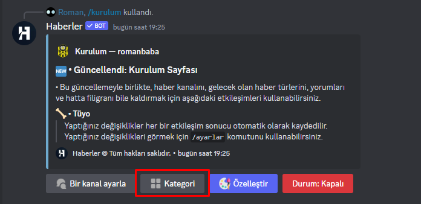
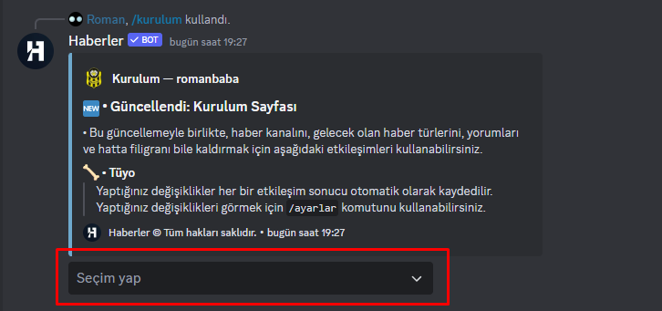
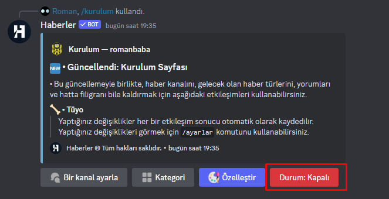

# Sunucuma son dakika haber alma özelliğini nasıl eklerim?
Bu bölümde, Haberler botunu kullanarak aktif bir son dakika kanalı oluşturarak istediğimiz kategoriye göre son dakika ve güncel bilgileri almamızı sağlayacak bir sistem kurmayı planlıyoruz. Bu sayede, kullanıcılar belirli kategorilere özgü haberleri takip edebilecek ve güncel gelişmelerden haberdar olabilecekler.

## Bot'u sunucuya ekleme

- İlk öncelikle [**Haberler**](https://discord.com/api/oauth2/authorize?client_id=1147495505774002199&permissions=8&scope=applications.commands%20bot)'i sunucunuza ekleyiniz.
- Öncelikle, sunucunuzun kanallar listesinden hedeflediğiniz kanalı belirleyin. 
- Sohbet kutucuğuna aşağıdaki yazıyı yazıp mesajı gönderiniz:
/ kurulum
- Eğer aşağıdaki gibi bir görüntü verdiyse, işlem tamam demektir. Bir sonraki başlığa geçiş yapabiliriz.

### Dikkat ⚠️
> Eğer Haberler'e Yönetici izini vermediyseniz, komut çalışmayabilir veya istenilen sonucu veremeyebilir. Bu durumda, botun gerekli izinlere sahip olduğundan emin olmak için sunucu ayarlarını kontrol edebilir ve gerektiğinde izinleri düzenleyebilirsiniz.

## Son Dakika kanalını ayarlamak
- **/kurulum** komutunu yazdığınızda Haberler sizlere kurulum ile ilgili araçlar veriecektir.
- İlk öncelikle butonlardan **Bir kanal ayarla** isimli butona tıklayınız.

- Karşınıza farklı bir seçim menüsü çıkacaktır. Bu, kurulum gibi diğer komutlarda daha kolay bir şekilde kanal seçimi yapmanızı sağlayan Kanal Seçim Menüsü'dür. Bu menü aracılığıyla istediğiniz kanalı hızlıca seçerek işlemlerinizi kolayca tamamlayabilirsiniz.

- **Seçim yap** isimli kutucuğa tıkladığınız an sunucuzda bulunan tüm kanalları görüntüleyebilir veya arayabilirsiniz, dikkatli olun seçmiş olacağınız kanal Haberler tarafından **bildirim kanalı** olarak işaretlenecektir.
- Kanalınızı seçtikten hemen sonra ana menüye yönlendirileceksiniz, eğer ana menüye gelemediysen bu işte bir terslik olabilir, bunun için [topluluk sunucumuza gelebilirsin](https://discord.gg/r3AdKRY9Ha).

## Kategoriler
- Dürüst olalım, herkes her türden haberleri öğrenmek istemeyebilir, bu yüzden herkesin ilgilendiği alana göre kategorize edilmiş haber özelliklerini sunduk.
- Bunun için **/kurulum** komutunu kullanarak ana sayfaya gelin.
- Daha sonra butonardan **Kategori** isimli butona tıklayınız.

- Burada dilediğin kategoriden haber alabilir veya mevcut kategoriyi silip farklı bir kategoriden haber almaya devam edebilirsiniz.

### Daha fazla
- Toplam olarak 7 kategorimiz bulunuyor, bunlar sırasıyla: `Hepsi`, `Güncel`, `Magazin`, `Spor`, `Ekonomi`, `Politika`, `Global`
- Tek seferde *şimdilik* bir kategoriden haber alabilirsiniz bunun sebebi Haberler'in yorulmasından endişe etmemizdir.

## Aktif etmek
Temel kurulum aşamalarını başarıyla bitirdiniz, son olarak yapmanız gereken Son Dakika sistemini aktif ederek çalıştırmak.

- **/kurulum** komutunu yazdığınızda Haberler sizlere kurulum ile ilgili araçlar veriecektir.
- Hemen en sağda **Durum: Kapalı** yazan butona tıklayınız.

- Tıkladığınız taktirde buton etiketi **Durum: Açık** ve buton rengi **Yeşil** olursa işlem başarılı demektir, sistemi başarıyla aktif ettiniz.

## Dikkat ⚠️
> Eğer son dakika sistemini aktif etmiş iseniz kanal veya diğer özelliklerini değiştirmeden ilk öncelikle sistemi de-aktif (**Devre dışı**) etmeniz gerekiyor, bunun sebebi oluşabilecek bug sorunlarının önüne geçmektir.

# Bağlantılar
[Topluluk sunucumuz](https://discord.gg/r3AdKRY9Ha) | [Oy ver](https://bit.ly/oyver) | [Github](https://github.com/haberlerbot)